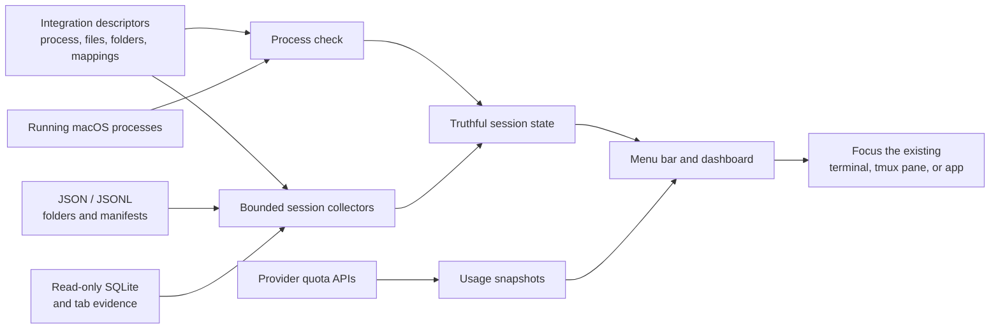

# Antarium

[](https://github.com/eppser/antarium/actions/workflows/ci.yml)
[](LICENSE)
[](https://github.com/eppser/antarium)

**See every coding agent. Know what is working. Stay ahead of your limits.**

Antarium is a lightweight macOS menu-bar app for people who run several coding
agents at once. It brings active sessions, status, context, cost estimates,
memory, and account limits into one quiet dashboard.

<p align="center">
  
</p>

## Why Antarium?

Running agents across terminals, Warp tabs, tmux panes, desktop apps, and agent
orchestrators gets hard to follow quickly. Antarium gives you one place to
answer:

- Which agents are still working?
- Which ones are waiting for me?
- Where is each session running?
- Which agents have project instructions, memory, skills, MCP, and permissions set up?
- How much context, memory, and estimated cost has it used?
- How close are my Claude, Codex, Cursor, or Copilot limits?

Get notified when an agent finishes. Click a session to return to its terminal,
tmux pane, or host app.

## Where Antarium fits

Tools such as [Conductor](https://www.conductor.build/) create isolated
workspaces and actively run agent tasks. Terminal agents such as
[Zen](https://vozen.io/) perform the coding work itself. Antarium complements
these tools: it is the neutral observability layer for supported agents already
running across your Mac, regardless of which terminal, editor, or workflow
started them.

Antarium does not create branches, edit code, or manage pull requests. That
keeps it lightweight and lets you keep the workflow you already use. See the
[ecosystem comparison](docs/ECOSYSTEM.md) for the exact boundaries and current
integration status.

## Features

- **One menu-bar view** for activity and quota across supported providers.
- **Working/waiting status** based on process and session evidence.
- **Multi-session awareness** for agents running in the same folder or app.
- **Context and usage visibility** without turning missing data into fake zeroes.
- **Terminal, Warp, tmux, and desktop-app detection.**
- **Remote tmux agents** over SSH, from machines you already reach with `ssh`.
- **Quota monitoring** for supported Claude, Codex, Cursor, and GitHub Copilot accounts.
- **Per-agent project setup overview** for supported harnesses, including
  instructions such as `CLAUDE.md` or `AGENTS.md`, memory, skills, MCP, and permissions.
- **Local-first and private:** no Antarium telemetry and no prompt collection.
- **Extensible harnesses:** add or adapt an agent without changing the app.

## How Antarium works



Agent-specific facts stay in JSON integration descriptors wherever possible.
Swift provides bounded collection, identity, lifecycle, authentication, cache
publication, and macOS UI behavior. Missing evidence stays missing—it is never
silently converted into zero or “finished.” The
[technical reference](docs/TECHNICAL.md#runtime-data-flow) explains the full
pipeline.

## Supported tools

Antarium currently includes harnesses for:

- Claude Code
- Codex CLI and Codex Desktop
- Cursor CLI and Cursor
- OpenCode
- Kimi Code
- Pi
- Hermes
- Zed
- VS Code with Copilot Chat

Install detection covers documented npm, curl/native, Homebrew, direct binary,
app-bundle, interpreter, and Nix layouts where the upstream tool supports them.

## Quick start

Antarium currently builds from source. You need macOS 13 or newer and a Swift
5.9-compatible Xcode toolchain.

```bash
git clone https://github.com/eppser/antarium.git
cd antarium
./build.sh --install
```

The script builds, signs, verifies, installs, and launches
`/Applications/Antarium.app`. Look for the Antarium gauge in your menu bar.

To run the full project checks:

```bash
./test.sh
```

Signed and notarized downloadable releases are on the [roadmap](Roadmap.md).

## Great for

- Running several Codex or Claude sessions in parallel.
- Keeping long-running tmux agents visible while you work elsewhere.
- Finding the Warp tab or desktop app that owns a session.
- Comparing activity across different coding-agent products.
- Watching context pressure and account limits before they interrupt work.
- Building support for an internal or newly released agent harness.

## Trustworthy numbers

Antarium treats “missing,” “zero,” and “failed to read” as different states.
It does not invent quota, context, token, cost, or session values. Cost is
clearly presented as an estimate, and configuration changes are covered by
synthetic fixtures and installation evaluations in CI.

## Remote tmux agents

Agents running under tmux on another machine appear alongside local ones,
tagged `tmux-remote`.

Adding a machine costs one line — the string you would type after `ssh`:

```json
{
  "includeRemoteTmux": true,
  "remoteTmuxHosts": ["quibus", "10.0.0.4", "deploy@build-box"]
}
```

List as many machines as you like. Each is asked in parallel, so a sweep costs
roughly the slowest host rather than the sum of them, and each is kept
independently: a machine that cannot be reached keeps the agents it last showed
and says why, while the others carry on updating. A machine that answers with
*no* agents is believed — that is a fact about that machine, not a failure — so
finished sessions disappear rather than lingering.

Nothing else is configured here on purpose. `~/.ssh/config` already holds the
port, the identity file, the real hostname and any jump host, and restating any
of it in Antarium would only be a second place for it to go stale.

**The prerequisite is that `ssh <host>` already works from your Terminal.**
Unknown host keys are not auto-accepted, so connect once by hand first and
verify the fingerprint yourself.

- **Key authentication** needs nothing further, and is the case to prefer.
- **Password authentication** is entered once in Settings and stored in your
  login Keychain under the service `Antarium tmux-remote`, never in
  `config.json`. It also needs [`sshpass`](https://sourceforge.net/projects/sshpass/)
  on this Mac: `brew install sshpass`.

Antarium runs one command per host per sweep — `tmux list-panes`, `ps`, and
`readlink /proc/*/exe` — and never starts, attaches to, or writes to a remote
session.

**What a remote row does not show:** status, token counts and cost. Those come
from transcript files that stay on the remote machine, so a remote row reports
the host and pane instead of a live status rather than guessing at one.

To see what each host actually answered:

```bash
Antarium --remote-tmux            # every configured host
Antarium --remote-tmux quibus     # just this one
```

## Private by design

Antarium runs locally and has no telemetry. It reads configured process and
session metadata and uses existing provider credentials only when requesting
supported quota information.

Remote tmux is the one feature that connects outward to a machine you name, and
it is off until you turn it on. It sends no data — it runs read-only inspection
commands and reads their output. The built-in dashboard can focus sessions, but it
does not terminate agents, terminal applications, or tmux sessions.

Custom harnesses are trusted local configuration and should be reviewed before
installation. See [SECURITY.md](SECURITY.md) for the full trust model.

## Extend Antarium

Each integration is described by a JSON harness. Most agent-specific details—
process names, files, SQLite queries, field mappings, open tabs, and status—live
in configuration. A typed Swift SDK and JSON Schema are available for authors.

Start with the [technical and harness reference](docs/TECHNICAL.md) when you
want to add an agent, generate a harness with the SDK, inspect diagnostics, or
understand the architecture.

## Project links

- [Technical and harness reference](docs/TECHNICAL.md)
- [Roadmap](Roadmap.md)
- [Contributing](CONTRIBUTING.md)
- [Security policy](SECURITY.md)

## License

Antarium is available under the [MIT License](LICENSE).
