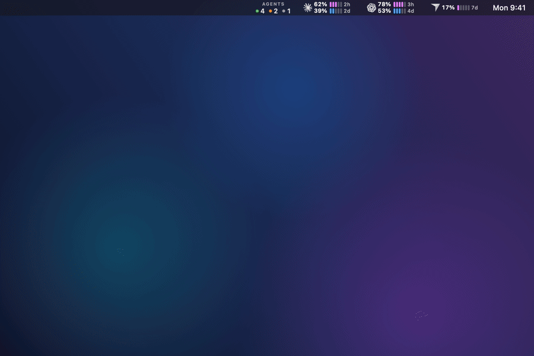
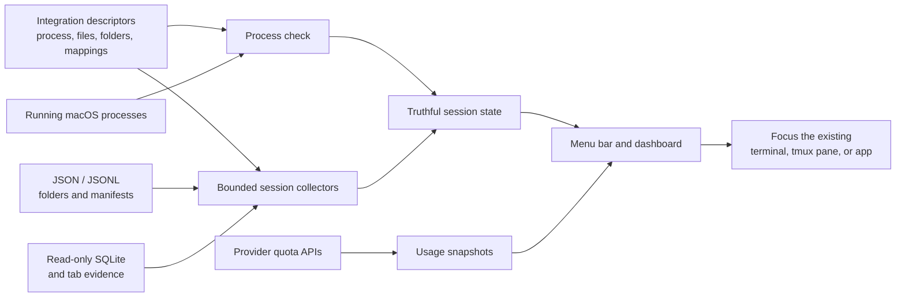

<div align="center">


# Antarium

**Mission control for your coding agents, in the macOS menu bar.**

See every Claude Code, Codex, Cursor, Copilot and Kimi session at once.<br>
Know which ones are working, which ones are waiting on you, and how close you are to your limits.

[](https://github.com/eppser/antarium/actions/workflows/ci.yml)
[](LICENSE)
[](https://github.com/eppser/antarium)
[](Package.swift)
[](Resources/harnesses)
[](SECURITY.md)

[Quick start](#quick-start) · [What it saves you](#what-it-saves-you) · [Features](#features) · [Supported tools](#supported-tools) · [How it works](#how-antarium-works) · [FAQ](#faq)

<br>



<sub>Rendered from an invented roster by <code>tools/make-demo-gif.sh</code> through the app's own views — no real machine, project or account.</sub>

</div>

---

## The problem

You started four agents before lunch. One is in a tmux pane, one in Warp, one
inside Cursor, one on a build box over SSH. Which finished? Which has been
sitting on a question for twenty minutes? Which one is about to hit the
five-hour limit halfway through a refactor?

Finding out means cycling through every window. **Antarium answers from the
menu bar, and tells you the moment an agent stops.**

## What it saves you

| Without Antarium | With Antarium |
| --- | --- |
| Cycling through terminal tabs, tmux panes and app windows to see who is done | A menu-bar count of working · waiting · ended, and a banner the moment an agent finishes |
| An agent idling on a question you never saw | Waiting sessions are marked orange and counted in the menu bar |
| Hunting for the window that owns a session | Click the row — Antarium focuses that terminal, tmux pane, Warp tab or app |
| Running out of quota mid-task | Remaining share and reset countdown for each account, before you start |
| Guessing how full a context window is | A context bar per session, from the agent's own token counts |
| Adding up spend by hand | An estimated cost per session and in total, priced from a table you can edit |
| Wondering which projects have `CLAUDE.md`, memory, skills, MCP or permissions set up | Five capability chips on every row |

It stays out of the way while it does it: a single native Swift app, no
Electron, no daemon, no account. Its idle cost is part of the release gate —
`./verify.sh` runs it for a minute and fails the build if it spends more than
6 s of CPU in the second thirty seconds or holds more than 400 MB.

> **No invented numbers.** Antarium does not claim to make you *N×* faster;
> nothing here measures your time, and this project does not print figures it
> cannot back. The same rule governs the app: a value it could not read is
> shown as missing, never as zero.

## Quick start

Antarium currently builds from source. You need macOS 13 or newer and a Swift
5.9-compatible Xcode toolchain.

```bash
git clone https://github.com/eppser/antarium.git
cd antarium
./build.sh --install
```

The script builds, signs, verifies, installs, and launches
`/Applications/Antarium.app`. Look for the Antarium gauge in your menu bar.
On first run it switches on the agents it finds installed and signed in, and
picks up sessions that are already running.

To run the full project checks:

```bash
./verify.sh
```

That is the gate the project requires: the suite three times over — as-is,
on a machine that has never run Antarium, and outside UTC — plus every
shipped harness checked, the assembled app inspected, and the scan
benchmark. `./test.sh` runs the suite alone and is the faster loop while
you work.

Signed and notarized downloadable releases are on the [roadmap](Roadmap.md).

## Features

<table>
<tr>
<td width="50%" valign="top">

### 🟢 Live status for every session
Working, waiting, looping, in a shell, ended — from process and session
evidence, not guesses. Several agents in the same folder or app are told
apart.

</td>
<td width="50%" valign="top">

### 🔔 Know the moment one finishes
A banner and an optional sound when an agent stops working. Click it to jump
straight back to that session.

</td>
</tr>
<tr>
<td valign="top">

### 📊 Limits before they bite
Quota for 20 providers in the menu bar — seven read natively, thirteen
described by a harness file you can edit or add to. Balances show as
balances, not as fake percentages.

</td>
<td valign="top">

### 🎯 One click back to the work
Terminal, Warp, tmux and desktop apps are detected. A click focuses the
window or pane that owns the session.

</td>
</tr>
<tr>
<td valign="top">

### 🧠 Context, tokens and cost
Context pressure, tokens sent and received, tool calls and an estimated
cost per session, with totals in the footer.

</td>
<td valign="top">

### 🛰️ Remote tmux over SSH
Agents in tmux on another machine appear alongside local ones. One line of
config per host; your `~/.ssh/config` does the rest.

</td>
</tr>
<tr>
<td valign="top">

### 🧩 Project setup at a glance
See which projects have instructions (`CLAUDE.md`, `AGENTS.md`), memory,
skills, MCP and permissions configured for the agent running in them.

</td>
<td valign="top">

### 🔒 Local-first and private
No Antarium telemetry, no prompt collection, no account. It reads session
metadata on your Mac and asks providers only for your own quota.

</td>
</tr>
</table>

## Why Antarium?

Running agents across terminals, Warp tabs, tmux panes, desktop apps, and agent
orchestrators gets hard to follow quickly. Antarium gives you one place to
answer:

- Which agents are still working?
- Which ones are waiting for me?
- Where is each session running?
- Which agents have project instructions, memory, skills, MCP, and permissions set up?
- How much context, memory, and estimated cost has it used?
- How close are my Claude, Codex, Cursor, or Copilot limits?

It is great for running several Codex or Claude sessions in parallel, keeping
long-running tmux agents visible while you work elsewhere, comparing activity
across different agent products, and building support for an internal or
newly released agent harness.

## Where Antarium fits

Tools such as [Conductor](https://www.conductor.build/) create isolated
workspaces and actively run agent tasks. Terminal agents such as
[Zen](https://vozen.io/) perform the coding work itself. Antarium complements
these tools: it is the neutral observability layer for supported agents already
running across your Mac, regardless of which terminal, editor, or workflow
started them.

Antarium does not create branches, edit code, or manage pull requests. That
keeps it lightweight and lets you keep the workflow you already use. See the
[ecosystem comparison](docs/ECOSYSTEM.md) for the exact boundaries and current
integration status.

## Supported tools

Antarium ships harnesses for 28 tools.

| Tool | Sessions in the dashboard | Usage in the menu bar |
| --- | :---: | :---: |
| Claude Code | ✓ | ✓ |
| Codex Desktop | ✓ | |
| ChatGPT (Codex) | ✓ | |
| Copilot CLI | ✓ | |
| GitHub Copilot | | ✓ |
| Cursor CLI | ✓ | |
| Cursor | ✓ | |
| VS Code (Copilot) | ✓ | |
| Zed | ✓ | |
| Kimi | ✓ | ✓ |
| Moonshot (Kimi API) | | ✓ |
| Gemini CLI | | ✓ |
| opencode | ✓ | |
| Mistral Vibe | ✓ | |
| OpenClaw | ✓ | |
| Herdr | ✓ | |
| Hermes | ✓ | |
| Orca | ✓ | |
| PI | ✓ | |
| Command Code | | ✓ |
| DeepSeek | | ✓ |
| MiniMax | | ✓ |
| MiniMax (China) | | ✓ |
| OpenRouter | | ✓ |
| Synthetic | | ✓ |
| Vercel AI Gateway | | ✓ |
| Z.ai GLM | | ✓ |
| Zhipu GLM | | ✓ |

A CLI and the account behind it are often separate harnesses, because one reads
sessions on this Mac and the other asks a service what is left. Kimi is one
harness that does both. The Moonshot entry is a different product — an API
balance paid by the token, not a subscription measured in requests.

Install detection covers documented npm, curl/native, Homebrew, direct binary,
app-bundle, interpreter, and Nix layouts where the upstream tool supports them.
Missing yours? [Add a harness](#extend-antarium) — usually a JSON file, no
Swift required.

## How Antarium works


```mermaid
flowchart LR
    H["Integration descriptors<br/>process, files, folders, mappings"] --> P["Process check"]
    H --> C["Bounded session collectors"]
    OS["Running macOS processes"] --> P
    FS["JSON / JSONL<br/>folders and manifests"] --> C
    DB["Read-only SQLite<br/>and tab evidence"] --> C
    P --> S["Truthful session state"]
    C --> S
    Q["Provider quota APIs"] --> U["Usage snapshots"]
    S --> UI["Menu bar and dashboard"]
    U --> UI
    UI --> F["Focus the existing<br/>terminal, tmux pane, or app"]
```

Agent-specific facts stay in JSON integration descriptors wherever possible.
Swift provides bounded collection, identity, lifecycle, authentication, cache
publication, and macOS UI behavior. Missing evidence stays missing—it is never
silently converted into zero or “finished.” The
[technical reference](docs/TECHNICAL.md#runtime-data-flow) explains the full
pipeline.

## Trustworthy numbers

Antarium treats “missing,” “zero,” and “failed to read” as different states.
It does not invent quota, context, token, cost, or session values. Cost is
clearly presented as an estimate, and configuration changes are covered by
synthetic fixtures and installation evaluations in CI.

<details>
<summary><b>How each provider's mapping was checked</b></summary>

<br>

The same rule applies to how a provider's mapping was checked, and the answer
changed after the mappings were audited. Of the thirteen described by a harness
file, five were compared field by field against the vendor's own published
response schema and name the page they were read from. The other eight have no
published schema at all.

For those eight the fixture used to be the whole of the check, and that turned
out not to be enough — because a fixture is written from the mapping it tests.
It proves the mapping is applied and cannot notice that the fields mean
something else. Four of the ten audited at the time were wrong behind a passing
fixture, and one of them, MiniMax, had expectations that were the exact mirror
of the truth: `current_interval_usage_count` is what remains, not what was
spent, so a meter read comfortable while the quota emptied.

So a mapping may now be corrected against another implementation of the same
API, where that implementation *states what a field means* rather than merely
using it — a comment recording a cross-check against the vendor's own
dashboard, an issue reporting the same inversion, a second tool deriving the
same figure. Two independent readings agreeing on a shape neither vendor
publishes is the closest thing to a specification these endpoints have. Where
only the paths are visible and nothing explains them, the mapping is left
alone and the doubt is written down.

`quota.checkedAt` and `source.checkedAt` record the day each mapping's figures
were last held against something outside this repository, whether a vendor
reference or another reader of the same files. A date going stale is the
signal to look again.

Every fixture is invented values in the vendor's own shape; no real account
response is ever committed.

</details>

## Remote tmux agents

Agents running under tmux on another machine appear alongside local ones,
tagged `tmux-remote`.

Adding a machine costs one line — the string you would type after `ssh`:

```json
{
  "includeRemoteTmux": true,
  "remoteTmuxHosts": ["build-box", "10.0.0.4", "deploy@build-box"]
}
```

List as many machines as you like. Each is asked in parallel, so a sweep costs
roughly the slowest host rather than the sum of them, and each is kept
independently: a machine that cannot be reached keeps the agents it last showed
and says why, while the others carry on updating. A machine that answers with
*no* agents is believed — that is a fact about that machine, not a failure — so
finished sessions disappear rather than lingering.

<details>
<summary><b>Prerequisites, authentication and what a remote row shows</b></summary>

<br>

Nothing else is configured here on purpose. `~/.ssh/config` already holds the
port, the identity file, the real hostname and any jump host, and restating any
of it in Antarium would only be a second place for it to go stale.

**The prerequisite is that `ssh <host>` already works from your Terminal.**
Unknown host keys are not auto-accepted, so connect once by hand first and
verify the fingerprint yourself.

- **Key authentication** needs nothing further, and is the case to prefer.
- **Password authentication** is entered once in Settings and stored in your
  login Keychain under the service `Antarium tmux-remote`, never in
  `config.json`. It also needs [`sshpass`](https://sourceforge.net/projects/sshpass/)
  on this Mac: `brew install sshpass`.

Antarium runs one command per host per sweep — `tmux list-panes`, `ps`, and
`readlink /proc/*/exe` — and never starts, attaches to, or writes to a remote
session.

**What a remote row does not show:** status, token counts and cost. Those come
from transcript files that stay on the remote machine, so a remote row reports
the host and pane instead of a live status rather than guessing at one.

To see what each host actually answered:

```bash
Antarium --remote-tmux            # every configured host
Antarium --remote-tmux build-box     # just this one
```

</details>

## Private by design

Antarium runs locally and has no telemetry. It reads configured process and
session metadata and uses existing provider credentials only when requesting
supported quota information.

Remote tmux is the one feature that connects outward to a machine you name, and
it is off until you turn it on. It sends no data — it runs one read-only
inspection command, which is a constant in this repository rather than
anything assembled at runtime, and reads the output. The built-in dashboard can
focus sessions, but it does not terminate agents, terminal applications, or
tmux sessions.

Custom harnesses are trusted local configuration and should be reviewed before
installation. See [SECURITY.md](SECURITY.md) for the full trust model.

## Extend Antarium

Each integration is described by a JSON harness. Most agent-specific details—
process names, files, SQLite queries, field mappings, open tabs, and status—live
in configuration. A typed Swift SDK and JSON Schema are available for authors.

Start with the [technical and harness reference](docs/TECHNICAL.md) when you
want to add an agent, generate a harness with the SDK, inspect diagnostics, or
understand the architecture.

## FAQ

<details>
<summary><b>Does Antarium read my prompts or code?</b></summary>

No. It reads session metadata — status, timestamps, token counts, the model
name — and never collects or transmits prompt content. There is no Antarium
server to send anything to.
</details>

<details>
<summary><b>Why does a row show “—” instead of a number?</b></summary>

Because the figure could not be read, and Antarium will not show a guess as a
fact. A dash means *unknown*; a zero means *observed to be zero*.
</details>

<details>
<summary><b>Why does one agent show a cost and another does not?</b></summary>

Cost is estimated from the agent's own token counts and a bundled price table.
Where a model has no price in the table, no cost is shown rather than an
invented one. You can add prices yourself.
</details>

<details>
<summary><b>Can it stop or restart my agents?</b></summary>

No. Antarium observes and focuses; it never terminates agents, terminals or
tmux sessions, and never writes to a remote session.
</details>

<details>
<summary><b>How do I regenerate the demo GIF?</b></summary>

`tools/make-demo-gif.sh` (needs `ffmpeg`). It renders an invented roster
through the app's own views, with display settings pinned in a throwaway
folder, so your own configuration is neither read nor written.
</details>

## Project links

- [Technical and harness reference](docs/TECHNICAL.md)
- [Ecosystem comparison](docs/ECOSYSTEM.md)
- [Roadmap](Roadmap.md)
- [Contributing](CONTRIBUTING.md)
- [Security policy](SECURITY.md)

## License

Antarium is available under the [MIT License](LICENSE).

<div align="center">
<br>
<sub>If Antarium saves you a trip through your terminal tabs, a ⭐ helps other people find it.</sub>
</div>
