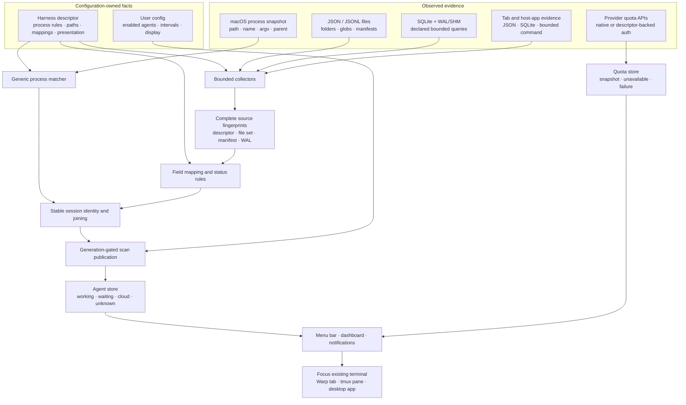

# Antarium technical and harness reference

This document covers Antarium’s architecture, harness format, SDK, evaluation
tools, diagnostics, and release workflow. For the product overview and quick
start, see the [README](../README.md).

## Design invariants

Antarium keeps three states distinct:

- a measured numeric zero;
- data that is absent or unsupported;
- data that could not be collected or parsed.

A failed command, malformed response, missing limit, or invalid SQLite query is
reported as unavailable or unhealthy. It is never converted into a successful
zero.

Harness files are trusted local configuration. Readers are bounded, SQLite is
opened read-only, and configured commands are launched directly as argv without
a shell. A third-party command can still have side effects under the user’s
permissions, so review custom harnesses before installing them.

## Architecture boundary

Each agent has one JSON harness. The runtime supplies bounded generic collection
mechanisms; the harness supplies agent-specific facts.

| Concern | Harness configuration |
|---|---|
| Process recognition | path fragments, exact names, argv[0], install probes, optional source-file binding |
| Session source | JSON, JSONL, SQLite, command, or none |
| Files and folders | path, glob, limit, manifests, and folder-derived fields |
| Record meaning | field maps, filters, status values, and token semantics |
| Open sessions | JSON files, read-only SQLite, or a JSON command |
| Project context | per-agent instruction, memory, skills, MCP, and permission probes |
| Quota integration | credentials, endpoint, headers, and usage-window mapping |
| Presentation/lifecycle | marks, labels, detached/multi-session behavior, idle/stale thresholds |

Swift remains responsible for stateful control flow and security boundaries:

- bounded process, file, SQLite, subprocess, Keychain, and HTTP collection;
- incremental parsing, cache fingerprints, cancellation, and publication;
- process-tree, terminal, tmux, AppKit, and focus behavior;
- Claude Code’s live per-PID registry;
- built-in Claude, Codex, and Cursor authentication providers.

The Cursor provider reads the existing desktop sign-in token from Cursor's
SQLite state store in read-only mode. Individual-plan quota currently comes
from the private Connect endpoint used by Cursor's own dashboard; Cursor does
not document that endpoint as a public API, so Antarium treats missing or
changed fields as unsupported instead of guessing. Cursor's
[documented Admin API](https://cursor.com/docs/account/teams/admin-api) remains
the supported option for organization-level analytics.

Relevant source areas:

- `Sources/Antarium/Core` — collection, mapping, caching, lifecycle, and models;
- `Sources/Antarium/Providers` — authenticated quota integrations;
- `Sources/Antarium/UI` — AppKit and SwiftUI presentation;
- `Sources/AntariumHarnessSDK` — typed public harness authoring API;
- `Resources/harnesses` — bundled descriptors;
- `Resources/harness-fixtures` — synthetic compatibility evidence.

## Runtime data flow

Antarium separates agent-specific evidence from generic collection and
stateful control flow. The same bounded runtime can therefore support a new
agent by loading a different descriptor instead of adding another bespoke
scanner.



The runtime takes one process snapshot per scan, applies descriptor-owned
matching rules, and joins matching processes to bounded session evidence.
Files, folder-derived fields, manifests, SQLite WAL/SHM state, and the complete
descriptor participate in cache fingerprints so a configuration or upstream
state change invalidates the correct result.

Publication is generation-gated: an older asynchronous scan cannot overwrite a
newer one. Collection failure, absent evidence, and measured numeric zero remain
separate through the stores and UI. Focusing a row activates an existing host;
the dashboard does not terminate agents, terminal applications, or tmux
sessions.

## User configuration

App settings are atomically stored at:

```text
~/.antarium/config.json
```

Common values:

```json
{
  "enabledAgents": ["claude-code", "codex"],
  "refreshMinutes": 10,
  "agentScanSeconds": 10,
  "includeCloudAgents": true,
  "meterMode": "used",
  "agentSort": "status",
  "dashboardPinned": false,
  "beams": 5,
  "rowColors": ["#E77DF9", "#389FF9"]
}
```

Account-usage polling and local-session scanning have independent intervals.

## Harness files

Bundled descriptors are seeded into:

```text
~/.antarium/harnesses/*.json
```

Untouched bundled files receive updates. Once edited, a file is user-owned and
preserved. Delete an edited bundled file to restore the current shipped version
on the next launch.

### Minimal JSONL harness

```json
{
  "$schema": "../harness.schema.json",
  "formatVersion": 1,
  "id": "my-agent",
  "name": "My Agent",
  "process": {
    "pathContains": ["/bin/my-agent"],
    "names": ["my-agent"],
    "argv0Contains": ["/@vendor/my-agent/"]
  },
  "source": {
    "kind": "jsonl",
    "path": "~/.my-agent/sessions",
    "glob": "*/*.jsonl",
    "limit": 20
  },
  "map": {
    "sessionID": "id",
    "cwd": "cwd",
    "model": "model",
    "timestamp": "timestamp",
    "inputTokens": "usage.input",
    "outputTokens": "usage.output",
    "cacheRead": "usage.cacheRead",
    "cacheWrite": "usage.cacheWrite",
    "status": {
      "field": "status",
      "working": ["busy"],
      "idle": ["idle"]
    }
  }
}
```

Field paths are dot-separated. Missing fields remain missing; numeric mappings
are not populated with guesses.

### Source types

- `jsonl` incrementally folds complete appended records and retains a partial
  final line for the next scan.
- `json` reads one object per matched file.
- `sqlite` runs a read-only query whose result columns have declared semantic
  meanings.
- `command` executes an argv array without a shell, drains bounded output,
  enforces a hard timeout, and accepts only exit code zero plus valid JSON.
- `none` contributes no generic local sessions and is used for quota-only or
  native live-registry integrations.

Source fingerprints include the complete descriptor, matched file set,
size/mtime/inode facts, manifests, and SQLite WAL/SHM state. Mapping edits,
deleted files, manifest changes, and WAL writes therefore invalidate the right
cache.

### Process-to-session binding

Several agent processes can share one working directory. For JSON or JSONL
sources, declare:

```json
"process": {
  "names": ["my-agent"],
  "sessionBinding": "openSourceFile"
}
```

Antarium then binds each process to the matching source file it actually holds
open. Helpers without a session file do not become rows.

### Installation evaluations

`process.installationProbes` documents and tests supported install layouts
without running installers:

```json
"installationProbes": [
  {
    "method": "npm",
    "path": "/usr/bin/node",
    "name": "node",
    "argv0": "/fixture/lib/node_modules/@vendor/my-agent/cli.js",
    "expected": true,
    "evidence": "https://vendor.example/docs/install",
    "verifiedAt": "2026-08-26"
  },
  {
    "method": "helper-collision",
    "path": "/Applications/My Agent.app/Contents/Frameworks/My Agent Helper",
    "name": "My Agent Helper",
    "argv0": "My Agent Helper",
    "expected": false,
    "evidence": "https://vendor.example/docs/install",
    "verifiedAt": "2026-08-26"
  }
]
```

Probes do not add matching behavior. They run synthetic observations through
the production matcher. Every bundled process-backed harness carries positive
install probes and a negative collision/helper probe with dated HTTPS evidence.

### Folder-derived metadata

When identity lives in directory names, `pathFields` avoids a custom reader:

```json
"source": {
  "kind": "jsonl",
  "path": "~/.cursor/projects",
  "glob": "*/agent-transcripts/*/*.jsonl",
  "limit": 1,
  "pathFields": {
    "title": { "ancestor": 3, "value": "name" },
    "sessionID": { "ancestor": 1, "value": "name" }
  }
}
```

`value` may be `name`, `stem`, or the absolute `path`.

### Manifests and filters

A sibling manifest can provide missing metadata:

```json
"manifest": {
  "file": "../../state.json",
  "map": { "cwd": "cwd", "title": "title" }
}
```

`source.filter` accepts a session only when its records satisfy every declared
field. This can separate products sharing one transcript directory.

### SQLite

```json
"source": {
  "kind": "sqlite",
  "path": "~/.local/share/agent/agent.db",
  "query": "SELECT id, directory, title, updated FROM session ORDER BY updated DESC LIMIT 40",
  "columns": ["sessionID", "cwd", "title", "lastActivity"]
}
```

`--check` rejects unknown semantic columns instead of silently treating them as
data.

### Open-session selection

For a multi-session store that retains closed history, independent UI state can
select the sessions that are actually open:

```json
"multiSession": true,
"selection": {
  "kind": "jsonFiles",
  "path": "~/Library/Application Support/my.agent",
  "glob": "window.*.dat",
  "records": "tabs",
  "encodedJSON": true,
  "id": "sessionId",
  "filter": { "type": ["session"] }
}
```

Selection also supports read-only SQLite and direct JSON commands. Unreadable
state is unknown and falls back to recent sessions; a successfully read empty
set means no open tabs.

### Capabilities

Capabilities are scoped to one harness and are never borrowed from another:

```json
"capabilities": {
  "instruction": {
    "probe": "content",
    "project": ["AGENTS.md"],
    "inherited": ["~/.codex/AGENTS.md"]
  },
  "skills": {
    "probe": "directory",
    "project": [".agents/skills"],
    "inherited": ["~/.agents/skills"]
  },
  "mcp": {
    "probe": "toml",
    "project": [".codex/config.toml"],
    "inherited": ["~/.codex/config.toml"],
    "keys": ["mcp_servers"]
  }
}
```

Supported probes are `content`, `directory`, `jsonObject`, and `toml`.

### Descriptor-backed quota providers

For agents without a built-in authentication flow, `quota` can describe a
read-only JSON endpoint. Credentials may come from an environment variable,
text file, JSON field, or bounded direct command. Mappings support used or
remaining percentages, count/limit ratios, reset times, labels, and filters.

Set `verified` only after comparing the mapping with the real service. Unverified
integrations remain visibly marked as such.

## SDK, schema, and migration

`AntariumHarnessSDK` is a public SwiftPM library product with typed models,
validation, sorted encoding, migration, and atomic writes:

```swift
import AntariumHarnessSDK

let source = HarnessConfig.Source(
    kind: .jsonl,
    path: "~/.my-agent/sessions",
    glob: "*.jsonl")

let harness = HarnessConfig(
    id: "my-agent",
    name: "My Agent",
    process: .init(
        names: ["my-agent"],
        argv0Contains: ["/@vendor/my-agent/"]),
    source: source,
    map: .init(cwd: "cwd", model: "model", sessionID: "id"))

try harness.write(to: URL(fileURLWithPath: "/tmp/my-agent.json"))
```

The canonical schema is
[`Resources/harness.schema.json`](../Resources/harness.schema.json).
Current documents use `formatVersion: 1`. Unversioned v0 documents migrate in
memory; unknown future versions fail closed.

Explicit migration is non-destructive and file-to-file:

```bash
BIN=dist/Antarium.app/Contents/MacOS/Antarium
$BIN --migrate-harness old.json migrated.json
```

SDK callers can use `HarnessConfigMigration.migrate` directly.

## Verification and evaluations

Check a harness against its live source:

```bash
$BIN --check ~/.antarium/harnesses/my-agent.json
```

The checker reports unknown nested keys, decoding/semantic failures, unsupported
columns, paths that match no real record, and numeric paths resolving to the
wrong type.

Deterministic bundled evaluations:

```bash
$BIN --verify-harness-fixtures
$BIN --verify-harness-installations
$BIN --evaluate-harness my-agent.json
```

Fixtures execute real globs, manifests, journal folding, filters, mappings, and
SQLite queries against synthetic bytes and compare every reported number.
Fixture verification proves the committed format, not that a private upstream
format can never change. `--check` supplies current-machine evidence.

Repository verification:

```bash
./test.sh
swift build --scratch-path /tmp/antarium-strict \
  -Xswiftc -strict-concurrency=complete -Xswiftc -warn-concurrency
./build.sh
```

## Numeric integrity

- Raw token facts are cached; estimated cost is recalculated from the current
  dated pricing table.
- Cache reads are not labelled as uploaded bytes.
- Subscription usage is not represented as a bill.
- A quota window missing its limit is omitted rather than shown as zero.
- Stable logical session identity does not depend on process replacement when
  stronger session evidence exists.
- Run-wrapper metadata stores argument count, never raw prompts or tokens.

Pricing overrides use the explicit bundled shape at:

```text
~/.antarium/pricing.json
```

Missing rates are rejected instead of receiving inferred vendor multipliers.

## Scan lifecycle and performance

Scans run away from AppKit. Only the newest generation may publish; a forced
refresh cancels and replaces older work. Local results publish first, supported
cloud results publish as a second phase, and the last valid cloud snapshot
survives a temporary failure. tmux state is sampled once per scan.

Measure the release build on the target machine:

```bash
$BIN --bench
```

CI also evaluates a synthetic 20,000-record JSONL source. The time budget is a
catastrophic-regression guardrail; exact cold, warm, and append byte/record
counts are the stronger algorithmic assertions.

## Diagnostics

```bash
BIN=dist/Antarium.app/Contents/MacOS/Antarium
$BIN --agents
$BIN --status
$BIN --bench
$BIN --once
$BIN --once claude-code
$BIN --focus <session>
$BIN --preview /tmp/sheet.png
$BIN --log 40
```

Logs default to warnings at `~/.antarium/logs/antarium.log`. Set
`ANTARIUM_LOG=debug` or `"logLevel": "debug"` for more detail.

## Distribution

Local builds use an ad-hoc signature. Public distribution can use a Developer
ID identity and an Apple notarytool keychain profile:

```bash
CODESIGN_ID="Developer ID Application: Example (TEAMID)" \
NOTARY_PROFILE="antarium-notary" \
VERSION="0.2.0" ./build.sh --notarize
```

The release path builds from a clean scratch directory, verifies the plist and
signature, submits and waits for notarization, staples and validates the ticket,
runs Gatekeeper assessment, recreates the archive, and writes its SHA-256.
Credentials are not accepted as command-line values or stored in the repository.

## Security boundary

Antarium has no telemetry and does not persist credentials, prompts, transcript
text, or raw command arguments in its metadata. The built-in dashboard may
focus or attach to a terminal or tmux pane, but it does not terminate agents,
terminal apps, tmux clients, or tmux sessions.

See [SECURITY.md](../SECURITY.md) for vulnerability reporting and the complete
trust model.
