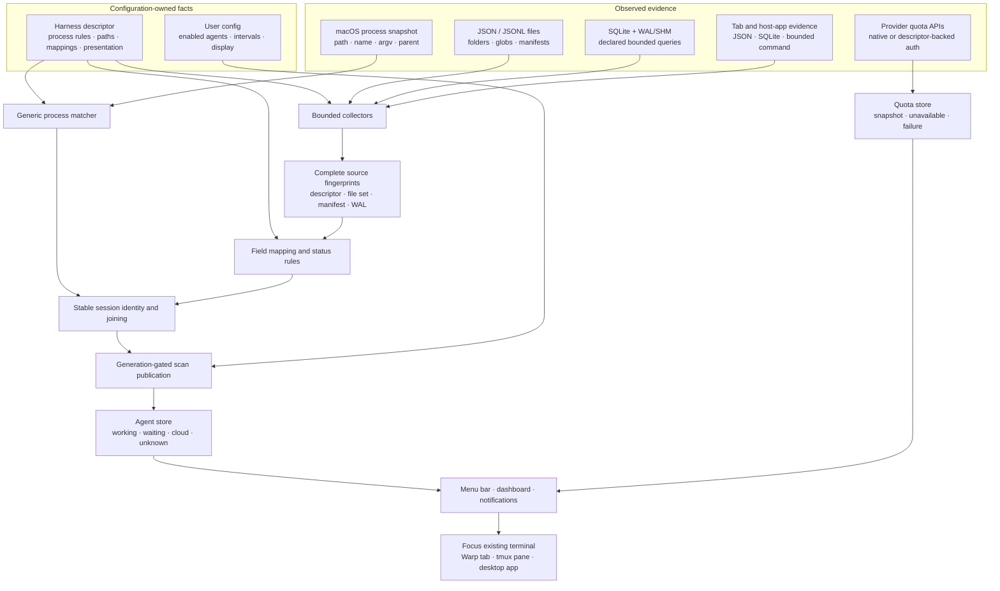

# Antarium technical and harness reference

This document covers Antarium’s architecture, harness format, SDK, evaluation
tools, diagnostics, and release workflow. For the product overview and quick
start, see the [README](../README.md).

## Design invariants

Antarium keeps three states distinct:

- a measured numeric zero;
- data that is absent or unsupported;
- data that could not be collected or parsed.

A failed command, malformed response, missing limit, or invalid SQLite query is
reported as unavailable or unhealthy. It is never converted into a successful
zero.

Harness files are trusted local configuration. Readers are bounded, SQLite is
opened read-only, and configured commands are launched directly as argv without
a shell. A third-party command can still have side effects under the user’s
permissions, so review custom harnesses before installing them.

## Architecture boundary

Each agent has one JSON harness. The runtime supplies bounded generic collection
mechanisms; the harness supplies agent-specific facts.

| Concern | Harness configuration |
|---|---|
| Process recognition | path fragments, exact names, argv[0], install probes, optional source-file binding |
| Session source | JSON, JSONL, SQLite, command, or none |
| Files and folders | path, glob, limit, manifests, and folder-derived fields |
| Record meaning | field maps, filters, status values, and token semantics |
| Open sessions | JSON files, read-only SQLite, or a JSON command |
| Project context | per-agent instruction, memory, skills, MCP, and permission probes |
| Quota integration | credentials, endpoint, headers, and usage-window mapping |
| Presentation/lifecycle | marks, labels, detached/multi-session behavior, idle/stale thresholds |

Swift remains responsible for stateful control flow and security boundaries:

- bounded process, file, SQLite, subprocess, Keychain, and HTTP collection;
- incremental parsing, cache fingerprints, cancellation, and publication;
- process-tree, terminal, tmux, AppKit, and focus behavior;
- Claude Code’s live per-PID registry;
- built-in Claude, Codex, and Cursor authentication providers.

The Cursor provider reads the existing desktop sign-in token from Cursor's
SQLite state store in read-only mode. Individual-plan quota currently comes
from the private Connect endpoint used by Cursor's own dashboard; Cursor does
not document that endpoint as a public API, so Antarium treats missing or
changed fields as unsupported instead of guessing. Cursor's
[documented Admin API](https://cursor.com/docs/account/teams/admin-api) remains
the supported option for organization-level analytics.

Relevant source areas:

- `Sources/Antarium/Core` — collection, mapping, caching, lifecycle, and models;
- `Sources/Antarium/Providers` — authenticated quota integrations;
- `Sources/Antarium/UI` — AppKit and SwiftUI presentation;
- `Sources/AntariumHarnessSDK` — typed public harness authoring API;
- `Resources/harnesses` — bundled descriptors;
- `Resources/harness-fixtures` — synthetic compatibility evidence.

## Runtime data flow

Antarium separates agent-specific evidence from generic collection and
stateful control flow. The same bounded runtime can therefore support a new
agent by loading a different descriptor instead of adding another bespoke
scanner.



The runtime takes one process snapshot per scan, applies descriptor-owned
matching rules, and joins matching processes to bounded session evidence.
Files, folder-derived fields, manifests, SQLite WAL/SHM state, and the complete
descriptor participate in cache fingerprints so a configuration or upstream
state change invalidates the correct result.

Publication is generation-gated: an older asynchronous scan cannot overwrite a
newer one. Collection failure, absent evidence, and measured numeric zero remain
separate through the stores and UI. Focusing a row activates an existing host;
the dashboard does not terminate agents, terminal applications, or tmux
sessions.

## User configuration

App settings are atomically stored at:

```text
~/.antarium/config.json
```

Common values:

```json
{
  "enabledAgents": ["claude-code", "codex"],
  "refreshMinutes": 10,
  "agentScanSeconds": 10,
  "includeCloudAgents": true,
  "meterMode": "used",
  "agentSort": "status",
  "dashboardPinned": false,
  "beams": 5,
  "rowColors": ["#E77DF9", "#389FF9"]
}
```

Account-usage polling and local-session scanning have independent intervals.

## Harness files

Bundled descriptors are seeded into:

```text
~/.antarium/harnesses/*.json
```

Untouched bundled files receive updates. Once edited, a file is user-owned and
preserved. Delete an edited bundled file to restore the current shipped version
on the next launch.

### Minimal JSONL harness

```json
{
  "$schema": "../harness.schema.json",
  "formatVersion": 1,
  "id": "my-agent",
  "name": "My Agent",
  "process": {
    "pathContains": ["/bin/my-agent"],
    "names": ["my-agent"],
    "argv0Contains": ["/@vendor/my-agent/"]
  },
  "source": {
    "kind": "jsonl",
    "path": "~/.my-agent/sessions",
    "glob": "*/*.jsonl",
    "limit": 20
  },
  "map": {
    "sessionID": "id",
    "cwd": "cwd",
    "model": "model",
    "timestamp": "timestamp",
    "inputTokens": "usage.input",
    "outputTokens": "usage.output",
    "cacheRead": "usage.cacheRead",
    "cacheWrite": "usage.cacheWrite",
    "status": {
      "field": "status",
      "working": ["busy"],
      "idle": ["idle"]
    }
  }
}
```

Field paths are dot-separated. Missing fields remain missing; numeric mappings
are not populated with guesses.

### Source types

- `jsonl` incrementally folds complete appended records and retains a partial
  final line for the next scan.
- `json` reads one object per matched file.
- `sqlite` runs a read-only query whose result columns have declared semantic
  meanings.
- `command` executes an argv array without a shell, drains bounded output,
  enforces a hard timeout, and accepts only exit code zero plus valid JSON.
- `none` contributes no generic local sessions and is used for quota-only or
  native live-registry integrations.

Source fingerprints include the complete descriptor, matched file set,
size/mtime/inode facts, manifests, and SQLite WAL/SHM state. Mapping edits,
deleted files, manifest changes, and WAL writes therefore invalidate the right
cache.

### Process-to-session binding

Several agent processes can share one working directory. For JSON or JSONL
sources, declare:

```json
"process": {
  "names": ["my-agent"],
  "sessionBinding": "openSourceFile"
}
```

Antarium then binds each process to the matching source file it actually holds
open. Helpers without a session file do not become rows.

### Installation evaluations

`process.installationProbes` documents and tests supported install layouts
without running installers:

```json
"installationProbes": [
  {
    "method": "npm",
    "path": "/usr/bin/node",
    "name": "node",
    "argv0": "/fixture/lib/node_modules/@vendor/my-agent/cli.js",
    "expected": true,
    "evidence": "https://vendor.example/docs/install",
    "verifiedAt": "2026-08-26"
  },
  {
    "method": "helper-collision",
    "path": "/Applications/My Agent.app/Contents/Frameworks/My Agent Helper",
    "name": "My Agent Helper",
    "argv0": "My Agent Helper",
    "expected": false,
    "evidence": "https://vendor.example/docs/install",
    "verifiedAt": "2026-08-26"
  }
]
```

Probes do not add matching behavior. They run synthetic observations through
the production matcher. Every bundled process-backed harness carries positive
install probes and a negative collision/helper probe with dated HTTPS evidence.

### Folder-derived metadata

When identity lives in directory names, `pathFields` avoids a custom reader:

```json
"source": {
  "kind": "jsonl",
  "path": "~/.cursor/projects",
  "glob": "*/agent-transcripts/*/*.jsonl",
  "limit": 1,
  "pathFields": {
    "title": { "ancestor": 3, "value": "name" },
    "sessionID": { "ancestor": 1, "value": "name" }
  }
}
```

`value` may be `name`, `stem`, or the absolute `path`.

### Manifests and filters

A sibling manifest can provide missing metadata:

```json
"manifest": {
  "file": "../../state.json",
  "map": { "cwd": "cwd", "title": "title" }
}
```

`source.filter` accepts a session only when its records satisfy every declared
field. This can separate products sharing one transcript directory.

### SQLite

```json
"source": {
  "kind": "sqlite",
  "path": "~/.local/share/agent/agent.db",
  "query": "SELECT id, directory, title, updated FROM session ORDER BY updated DESC LIMIT 40",
  "columns": ["sessionID", "cwd", "title", "lastActivity"]
}
```

`--check` rejects unknown semantic columns instead of silently treating them as
data.

### Open-session selection

For a multi-session store that retains closed history, independent UI state can
select the sessions that are actually open:

```json
"multiSession": true,
"selection": {
  "kind": "jsonFiles",
  "path": "~/Library/Application Support/my.agent",
  "glob": "window.*.dat",
  "records": "tabs",
  "encodedJSON": true,
  "id": "sessionId",
  "filter": { "type": ["session"] }
}
```

Selection also supports read-only SQLite and direct JSON commands. Unreadable
state is unknown and falls back to recent sessions; a successfully read empty
set means no open tabs.

### Capabilities

Capabilities are scoped to one harness and are never borrowed from another:

```json
"capabilities": {
  "instruction": {
    "probe": "content",
    "project": ["AGENTS.md"],
    "inherited": ["~/.codex/AGENTS.md"]
  },
  "skills": {
    "probe": "directory",
    "project": [".agents/skills"],
    "inherited": ["~/.agents/skills"]
  },
  "mcp": {
    "probe": "toml",
    "project": [".codex/config.toml"],
    "inherited": ["~/.codex/config.toml"],
    "keys": ["mcp_servers"]
  }
}
```

Supported probes are `content`, `directory`, `jsonObject`, and `toml`.

### Workspace harnesses

Herdr and Orca host other agents rather than being agents. A Claude session in
a Herdr pane is the same conversation the `claude-code` harness already
reports, so a harness that emitted both would show every agent twice — once
with its real figures and once as an empty duplicate.

`contributes: "focus"` says: read these records, use them to say how each
session is raised, and make no rows. The join is on the agent's own session id
where the manager publishes one — Herdr does, and it is exact. Otherwise on
the working directory, which is weaker: one pane in a folder says nothing
about which of two agents working there it holds, so a directory claimed by
more than one row or pane is left alone. A target is never handed to two rows.
Focusing the wrong pane is worse than focusing none.

`focus` declares how to raise a session. `{focusTarget}` in an argument is
replaced with the session's `map.focusTarget` value — a tab id for Herdr, a
terminal handle for Orca, neither of which is the session id. The command runs
directly rather than through a shell, and appears in the reviewed command
allowlist alongside source and credential commands, because a command run when
a row is clicked is still a command this application runs.

Both read their live state through `source.kind: "command"`. Their fixtures
replace that command with one that prints a recorded reply, so the mapping,
the records path and every field path are exercised without either tool being
installed.

### Agents that keep no session record

Gemini CLI writes a settings file, a project list and a `.project_root` marker
per directory, and nothing describing a conversation. There is no transcript,
so there are no tokens, no cost and no context figure.

`contributes: "presence"` makes a row per matching process and leaves every
figure absent — not zero. "No tokens recorded" and "zero tokens used" are
different statements and only the first is true. The state is `unobserved`
rather than `waiting`, for the same reason: whether the agent is idle is a
claim this harness cannot make. The row carries a note saying why it is empty,
because a line of dashes otherwise reads as an agent that has done nothing.

### Descriptor-backed quota providers

For agents without a built-in authentication flow, `quota` can describe a
read-only JSON source: an endpoint fetched with a GET or a POST, or a command
whose stdout is the payload. The reply is mapped onto gauges; anything that
needs control flow — an OAuth refresh, request signing, a browser cookie,
parsing a CLI's *text* output — belongs in Swift under
`Sources/Antarium/Providers` instead. The shapes themselves are described
under "Quota transport" below, which is the authority: this paragraph says
what belongs here rather than how to write it.

`credential` resolves the token, from `env`, `textFile`, `jsonFile` (with
`field`), or a bounded `command`. `headers` may interpolate `{token}`;
without it, `Authorization: Bearer {token}` is assumed.

A `jsonFile` credential may add `requires`, a map of field path to required
substring, checked in the same file before the token is used or counted as a
sign-in. It exists for credentials that live somewhere shared: Z.ai's plan is
driven through Claude Code, so its token is whatever sits in
`env.ANTHROPIC_AUTH_TOKEN` — a field Kimi, MiniMax, a corporate gateway and a
plain Anthropic key all write too. Without a second field to check, any of
those reads as a Z.ai sign-in and is sent to Z.ai's endpoint. Z.ai requires
`env.ANTHROPIC_BASE_URL` to contain `z.ai`. Matching is case-insensitive, an
absent field fails closed, and the check is refused at decode on any other
credential kind, where it would silently do nothing.

The scheme rule is under "Quota transport"; it is not repeated here, because
it changed and this copy did not. Redirects are followed only within the same scheme and host. The headers live
on the session's `httpAdditionalHeaders`, so `URLSession` carries the
Authorization header onto whatever a redirect points at, and does not drop it
when the host changes — a usage endpoint answering `302 Location: elsewhere`
would otherwise hand that host the user's token. A refused redirect is
reported as itself rather than as whatever the 3xx happens to look like.

Anything a fresh install would do outward — connect to another machine, make
a noise, show an alert — defaults to off, and a test reads
`Settings.swift` to enforce it rather than reading the accessors at runtime.
`Config` binds to the real settings directory the first time it is touched,
so a runtime check reports whoever is running it: the first version of that
test asserted alerts were off and failed, because on the machine it ran on
they are on. Reading cloud tasks is the one deliberate exception, because it
costs a request that was going to be made anyway.

Paths are compared as Strings, never as bytes. macOS hands back a decomposed
filename — `e` followed by a combining acute — while a path an agent writes
into its transcript is usually composed, and the two are equal as Strings and
different as bytes. A project folder with an accent in its name loses its
session the moment a comparison is made on `utf8` for speed, which has already
happened once in this file for a different scan.

SwiftUI's `Text("\(x)")` takes a `LocalizedStringKey` and groups digits for
the reader, which is how 10259 once reached the bar as "10.259". Every
interpolation goes through `Text(verbatim:)` instead, enforced by a test —
over all of them rather than the numeric ones, because which is which cannot
be told from the source and a rule needing judgement is a rule nobody
applies.

A `DateFormatter` with a fixed `dateFormat` is pinned to `en_US_POSIX`, and
no calendar comes from `Calendar.current` — that carries the reader's
calendar system and their zone, so a date built through it is a different
instant for a different person. Tests in `ArchitectureContractTests` read the
sources to enforce both. That is a
source rule rather than a run under another locale because `Locale.current` on
macOS comes from user defaults and ignores the environment — there is no `TZ`
equivalent to set, so the mistake has to be caught where it is written.
Without it the hour field follows the reader's own preferences, so a Mac with
24-Hour Time switched off writes a twelve-hour clock with no am/pm and every
log line is ambiguous between morning and afternoon. Formatters that render
for a person — the row's clock, which uses `dateStyle` and `timeStyle` — are
deliberately left localised, because that is the one place the reader's
preference is the right answer.

Anything iterated out of a `Set` or a `Dictionary` and then shown, written,
compared *or chosen from* is sorted first — the sixth instance found was a
cache evicting `keys.first`, which is not merely unreproducible but can drop
the entry about to be read again, repeatedly. Their order is stable within one process and not
across runs, so an unsorted iteration looks correct in every test that was
ever written for it and differs on somebody else's machine. Three of those
were found in one sweep — the glob search that finds session files, the rows
parsed from a remote host, and the rows a harness claiming several processes
produces — and a final sort does not rescue them, because rows tied on its
key keep whatever order they arrived in.

Every reader that turns input from outside this process into objects bounds
the objects, not only the bytes. The two are different budgets and the second
does not imply the first: four megabytes of small JSON records is tens of
thousands of sessions, and each one becomes a row, a sort key and a
transcript read. The caps are 64 usage windows per response, 256 rows per
remote host, 256 sessions per command harness, 400 files per file harness,
2,000 rows per SQLite query and 2,000 cloud tasks per inventory. Three of
those were missing and were found one at a time; the rule is written down
here so the next reader inherits it rather than repeating them.

A budget is a ceiling rather than a default: `BoundedSQLite.query` takes
`maxRows` and applies `min(2_000, …)`, so a caller can lower it and not raise
it.

The bounded-objects rule applies to folders the app writes, not only to ones
it reads. `antarium run <agent>` records each invocation as a small JSON file
under `~/.antarium/runs`, nothing reads them back, and so nothing noticed
that the folder had no bound on how many it held — a few hundred bytes each
is exactly why a bytes rule would not have caught it. The newest 500 are
kept, ordered on the timestamp the filename begins with rather than on
modification time, which a copy or a restore rewrites.

A reading that has stopped being refreshed says so. `QuotaStore` keeps the
last good snapshot when a fetch fails — deliberately, so a bar does not blink
out every time a network hiccups — and the cost of that is a figure which
goes on looking current. The menu already reported "Updated ten minutes ago";
the dashboard drew the same number with nothing at all, so the two surfaces
disagreed about whether what was on screen was now. Past five minutes, which
is several missed refreshes, the bar dims and its tooltip says when the
reading was taken. Dimmed rather than hidden: the figure is still the best
there is, and why it is old is already reported where failures belong.

The settings directory is private to its owner, and tightened on launch if
it is not. It was created at 0755, which was unremarkable while it held
preferences; descriptors now name key files inside it, and on macOS every
local account is in `staff`, so a home directory at 0750 is traversable by
all of them. The directory rather than the file, because the user writes the
file with whatever umask they have — a directory nobody else may enter
protects what is in it regardless. Only ever tightened, never loosened, and
left untouched when it is already right, so a launch is not a change of mtime.

### Adding a quota provider

Five steps, none of which need the service installed or an account with it.

1. Find the vendor's own statement of the endpoint and the response shape. A
   field path taken from another monitoring tool's source is a guess about
   somebody else's product that happens to work today; `docs/ECOSYSTEM.md`
   lists the services turned down for exactly that reason.
2. Write `Resources/harnesses/<id>.json` with `source.kind` of `none` and a
   `quota` block. `verified` stays `false` until somebody has seen the
   numbers against a live account, and the row says so.
3. Write `Resources/quota-fixtures/<id>.json`: a `cases` array of recorded
   payloads with the gauges each should produce. Include the shapes that must
   *not* chart — an account with no plan, a reply missing the figures — with
   `expectError`. Every value is invented; no real payload belongs in this
   repository.
4. `antarium --check Resources/harnesses/<id>.json` for the descriptor, and
   `antarium --verify-harness-quota` for the mapping. The second runs the
   fixture through the real provider code, which is what makes this testable
   with nothing installed.
5. Add the mapping's load-bearing parts to `mutations.txt` and run
   `./mutate.sh` over just those lines. A fixture proves the mapping works
   today; a mutation proves a test would notice when it stops.

A source field that its `kind` never reads is reported by `--check`. A key
list catches a typo; it cannot catch a field spelled correctly and ignored —
`limit` on a SQLite source, which bounds newest *files* and so means nothing
where there is one file, or `query` on a JSONL one. Both passed clean while
doing nothing. `glob`, `limit`, `journal`, `pathFields` and `manifest` are
read for `json` and `jsonl`; `query` and `columns` for `sqlite`; `args`,
`refreshEvery` and `root` for `command`. It is a warning rather than a
refusal: a leftover field does no harm beyond the silence, and refusing would
break files people already have.

`selection` has the same shape and the same check. `glob`, `records` and
`encodedJSON` are read when selecting by `jsonFiles`; `query` and `column`
when selecting by `sqlite`; `command`, `args` and `root` when selecting by
`command`. `id` and `filter` belong to the two kinds that read records — a
sqlite selection takes its ids straight out of a column and consults
neither.

A quota credential is the third object with a `kind` and gets the same
treatment: `name` for `env`, `field` for `jsonFile`, `command` and `args` for
`command`, and `path` for the three kinds that read a file — including `env`,
which falls back to one when its variable is unset. `requires` is not in that
table because the decoder already refuses it outright on anything but a
`jsonFile`: a guard that silently does nothing is worse than no guard, and a
warning where there is already a refusal would be unreachable.

### Quota transport

A `balance` must declare a `currency` — a path into the response where the
service states one, or the code itself. The mapping used to answer "USD" for
a descriptor that declared none, which turns a CNY balance into a dollar
figure wrong by an exchange rate. Neither shipped descriptor relied on that
default; it was a trap set for whoever wrote the next one, and the decoder
refuses it now rather than guessing.

An `env` credential reads its variable first and the file at its `path`
second. The fallback is not decoration: an app started from Finder inherits
the launchd session environment rather than a shell's, so a key exported in a
shell profile is invisible to it, and three shipped providers could not work
in the ordinary installation. The variable still wins when both are present,
so a key rotated in a shell is not overridden by a stale file.

A usage endpoint must be https, or http to this machine. Every usage request
carries a credential, and plaintext to somewhere else would put it on a wire;
plaintext to loopback never reaches one. Refusing it outright meant a
self-hosted proxy in front of an agent — LiteLLM and its kind, which are http
on a port by default — could not be described at all unless somebody put a
certificate in front of a loopback socket, which nobody does. `0.0.0.0` is
not accepted: it is a bind address meaning every interface rather than a
destination meaning here, and anyone who meant loopback can write it.

An endpoint quota may declare `method: "POST"` and a flat `body`, with
`{token}` substituted the way it is in `headers`. Not every usage API is a
GET — Codebuff posts to its usage path, and Kimi's server endpoint is a POST
— and a model that could only describe a GET forced native code for a reason
with nothing to do with whether the mapping was expressible. An unrecognised
method is refused rather than defaulted, because a typo reads as GET and the
descriptor would fetch the wrong way and report whatever a GET to that path
returns.

A `quota` block reads from exactly one place: an `endpoint`, or a `command`
whose stdout is the JSON the `windows` map describes. Both would leave which
one wins to the order of an `if`, and neither is a quota block that does
anything, so the decoder refuses each. The command form exists because some
services have stopped answering over HTTP at all, and a model that can only
describe an endpoint forces native code for an agent whose mapping is
perfectly expressible.

A quota command is argv and never a shell, must be a program name rather than
a path, is bounded in time and output, and appears in the allowlist test in
`ExtensibilityAndReleaseTests.swift` beside every other command a shipped
harness may run. Its failures are told apart rather than folded together:
`Shell.Result.completeOutput` is `succeeded && !stdoutTruncated`, so a
command that exits non-zero printing nothing reads as one that printed too
much unless the cases are asked separately.

A capability probe may declare `fileSuffixes`, and then a directory counts
only the entries whose names end with one of them. Some conventions are a
folder where the agent reads one kind of file and ignores the rest — Cursor's
documentation says a plain `.md` in `.cursor/rules` is ignored because it
carries no frontmatter — and counting every entry would report a capability
for a folder the agent never reads. The filter is opt-in: without it every
entry counts, which is what the other conventions here want.

Suffixes rather than extensions, because a convention can require more than
an extension: Copilot's scoped instructions must end `.instructions.md`, and
the path extension of `style.instructions.md` is `md`, the same as a file
Copilot ignores. The filter applies wherever a probe looks at a directory,
including a `content` rule — Copilot's one rule lists a file, a folder and
three more files, and a filter that applied to only one probe kind would
count files the agent never reads.

`windows` says where the limits are and what they mean. At most 64 are read
from one response, and text the response supplies — a window title, a
currency code, a composite key — is clamped to 64 characters. The 2 MiB body
cap bounds the transfer, not what is built from it: 2 MiB of small objects is
tens of thousands of windows, and each becomes a gauge, a menu bar line and
an alert evaluation. Labels the descriptor itself declares are trusted local
configuration and are not clamped.

**Finding the windows.** Responses come in three shapes:

| Shape | Fields | Example |
| --- | --- | --- |
| Object keyed by window name | `root` (or `roots`), optional `keys` | Copilot's `quota_snapshots` |
| Array of windows | `list`, `key` | Z.ai's `data.limits`, MiniMax's `model_remains` |
| One flat window | `single` | Vercel's `{"balance": …}` |

`roots` takes candidate paths in order, for a service that wraps its payload in
an envelope on some calls and not others — Command Code returns `windowLimits`
at the top level or under `data`. Declaring one and guessing wrong makes the
gauges silently vanish on the other shape.

`key` is a list because one field is not always enough to name a window: Z.ai
reports two `TOKENS_LIMIT` rows that differ only by `unit`, so keying on `type`
alone collapses the weekly cap into the session one and hides the limit users
hit most. Several paths are joined with `-`. `keys`, where given, both filters
and orders, for either shape.

**Reading the figure.** Exactly one of these per window:

| Fields | Meaning |
| --- | --- |
| `usedPercent` | 0–100 consumed |
| `percentRemaining` | 0–100 left |
| `used` + `limit` | a ratio; a window with no limit is skipped, because "0 of nothing" is not 0% |
| `balance` (+ `currency`) | a figure with no denominator |

A `balance` draws its amount and **no bar**. A credit balance has no cap to
fill against, and pinning such a gauge to 100% — which is what a
percentage-only model forces — paints the same full green meter whether $500 or
two cents remain. `currency` is a path into the window where the service
reports one, otherwise a literal ISO 4217 code; it is not assumed, because
DeepSeek bills some accounts in CNY and a dollar sign there misstates the
balance by an exchange rate.

**Presentation.** `labels` names each window, `badges` gives the two-to-four
character menu-bar tag where abbreviating the label reads badly ("Premium"
becomes "PRE", "Tools" becomes "TOO"). `title` is a path into the window for a
service that names its own windows, used where `labels` gives no name. `windowSeconds` and `resetsAt` are read
per window, falling back to the response root. `require` skips a window unless
every pair matches — a free Copilot plan lists a premium tier it does not have.

**Verification.** Every shipped descriptor that declares `quota` must have a
recorded response shape in `Resources/quota-fixtures/<id>.json`, checked by:

```bash
Antarium --verify-harness-quota
```

The fixture replays a synthetic response through the real mapping and compares
every gauge — id, badge, title, percentage, window length, reset time, and for
a balance its figure and currency.

Session fixtures verify the focus target alongside the session fields. A focus
mapping that resolves to nothing fails silently — the row falls back to raising
the application, which looks like it worked — so renaming Herdr's `tab_id` was
invisible until the fixture began checking it.

A quota fixture file holds either one case at the top level or a `cases` array,
and a case declares `expected` or `expectError`. The second matters as much as the first:
a plan that includes no windows at all must be refused, not charted as a row of
zeros, and that is a behaviour a success-only fixture cannot state. Copilot
records a free plan whose every tier reports `has_quota: false`, MiniMax an
account whose models are all unmetered, DeepSeek an account with no balances —
each `expectError: unsupported`. Removing Copilot's `has_quota` filter, or
accepting a zero limit as a denominator, fails them. No account, no network, and no installed
agent is involved, so a wrong field path fails at build time rather than on a
stranger's Mac. Fixtures are invented values in the vendor's published shape;
no real account response is ever committed.

Set `verified` only after comparing the mapping with the real service. A
passing fixture proves the mapping resolves, not that the numbers are right.
Unverified integrations stay visibly marked as such in Settings.

## SDK, schema, and migration

`AntariumHarnessSDK` is a public SwiftPM library product with typed models,
validation, sorted encoding, migration, and atomic writes:

```swift
import AntariumHarnessSDK

let source = HarnessConfig.Source(
    kind: .jsonl,
    path: "~/.my-agent/sessions",
    glob: "*.jsonl")

let harness = HarnessConfig(
    id: "my-agent",
    name: "My Agent",
    process: .init(
        names: ["my-agent"],
        argv0Contains: ["/@vendor/my-agent/"]),
    source: source,
    map: .init(cwd: "cwd", model: "model", sessionID: "id"))

try harness.write(to: URL(fileURLWithPath: "/tmp/my-agent.json"))
```

The canonical schema is
[`Resources/harness.schema.json`](../Resources/harness.schema.json).
Current documents use `formatVersion: 1`. Unversioned v0 documents migrate in
memory; unknown future versions fail closed.

Explicit migration is non-destructive and file-to-file:

```bash
BIN=dist/Antarium.app/Contents/MacOS/Antarium
$BIN --migrate-harness old.json migrated.json
```

SDK callers can use `HarnessConfigMigration.migrate` directly.

## Verification and evaluations

Check a harness against its live source:

```bash
$BIN --check ~/.antarium/harnesses/my-agent.json
```

The checker reports unknown nested keys, decoding/semantic failures, unsupported
columns, paths that match no real record, and numeric paths resolving to the
wrong type.

Deterministic bundled evaluations:

```bash
$BIN --verify-harness-fixtures
$BIN --verify-harness-installations
$BIN --evaluate-harness my-agent.json
```

Fixtures execute real globs, manifests, journal folding, filters, mappings, and
SQLite queries against synthetic bytes and compare every reported number.
Fixture verification proves the committed format, not that a private upstream
format can never change. `--check` supplies current-machine evidence.

Repository verification:

```bash
./test.sh
swift build --scratch-path /tmp/antarium-strict \
  -Xswiftc -strict-concurrency=complete -Xswiftc -warn-concurrency
./build.sh
```

## Numeric integrity

- Raw token facts are cached; estimated cost is recalculated from the current
  dated pricing table.
- Cache reads are not labelled as uploaded bytes.
- Subscription usage is not represented as a bill.
- A quota window missing its limit is omitted rather than shown as zero.
- Stable logical session identity does not depend on process replacement when
  stronger session evidence exists.
- Run-wrapper metadata stores argument count, never raw prompts or tokens.

Pricing overrides use the explicit bundled shape at:

```text
~/.antarium/pricing.json
```

Missing rates are rejected instead of receiving inferred vendor multipliers.

## Scan lifecycle and performance

Scans run away from AppKit. Only the newest generation may publish; a forced
refresh cancels and replaces older work. Local results publish first, supported
cloud results publish as a second phase, and the last valid cloud snapshot
survives a temporary failure. tmux state is sampled once per scan.

Measure the release build on the target machine:

```bash
$BIN --bench
```

CI also evaluates a synthetic 20,000-record JSONL source. The time budget is a
catastrophic-regression guardrail; exact cold, warm, and append byte/record
counts are the stronger algorithmic assertions.

### Agents shown on first run, and on upgrade

The menu bar used to default to a fixed list written when three agents existed.
`AgentAutoEnable` picks from evidence instead — signed in here, or sessions on
disk — the first time no choice is recorded, and never rewrites one afterwards.
At most four are switched on, strongest evidence first, so a Mac carrying
traces of eight does not open to eight items.

"Never rewrite a recorded choice" leaves one case uncovered: an agent that
ships *after* the user chose is one they have never been asked about.
`knownAgents` records every provider id an install has put in front of them, so
a new provider can be told from a rejected one. A new provider that is signed
in is adopted; one with sessions but no credential is not, because that item
could only say "sign in". The cap still applies, so adopting cannot turn three
items into ten. An install with no `knownAgents` yet records the current list
and adopts nothing, since it cannot tell the two apart.

    Antarium --detect-agents          # what a first run would switch on, and why
    Antarium --detect-agents --apply  # write it, declining if a choice exists

### Reading a large transcript history

`BoundedTraceReader` reads at most a few megabytes per file per scan, so no
single scan can block on a long history. A session's transcript is append-only
and can reach hundreds of megabytes: two on the development machine measured
193 MB and 105 MB. Absorbing those takes tens of scans rather than one.

While a file is behind, its stats carry `backlog` and the session reports
that its usage figures are not yet available — deliberately, since a partial
read is a wrong total, not a smaller one. The cursor advances monotonically and
is persisted, so the work is never repeated and a relaunch resumes where the
last process stopped.

The practical shape, measured on a history of that size: the first scans cost
roughly 100–170 ms and CPU sits near 10% of one core, falling to ~13 ms and
under 2% once the backlog clears — around six minutes at the default interval.

`--bench` seeds the harness folder before scanning, like every other
command-line entry point, so it always measures the full shipped set. Pointing
`ANTARIUM_HOME` at a directory containing one descriptor does not measure one
descriptor — the other twenty-one are written back before the first pass. A
subset has to be removed from `Resources/harnesses` and the app rebuilt.

**This makes `--bench` on a machine with an unabsorbed backlog a measurement of
catch-up throughput, not of steady state.** Run it repeatedly until
`transcripts-v6.json` reports no file with `backlog` set before comparing
builds, or the numbers describe how fast history is being consumed rather than
what a scan costs.

## Diagnostics

```bash
BIN=dist/Antarium.app/Contents/MacOS/Antarium
$BIN --agents
$BIN --status
$BIN --bench
$BIN --once
$BIN --once claude-code
$BIN --focus <session>
$BIN --preview /tmp/sheet.png
$BIN --log 40
```

Logs default to warnings at `~/.antarium/logs/antarium.log`. Set
`ANTARIUM_LOG=debug` or `"logLevel": "debug"` for more detail.

## Distribution

Local builds use an ad-hoc signature. Public distribution can use a Developer
ID identity and an Apple notarytool keychain profile:

```bash
CODESIGN_ID="Developer ID Application: Example (TEAMID)" \
NOTARY_PROFILE="antarium-notary" \
VERSION="0.2.0" ./build.sh --notarize
```

The release path builds from a clean scratch directory, verifies the plist and
signature, submits and waits for notarization, staples and validates the ticket,
runs Gatekeeper assessment, recreates the archive, and writes its SHA-256.
Credentials are not accepted as command-line values or stored in the repository.

## Security boundary

Antarium has no telemetry and does not persist credentials, prompts, transcript
text, or raw command arguments in its metadata. The built-in dashboard may
focus or attach to a terminal or tmux pane, but it does not terminate agents,
terminal apps, tmux clients, or tmux sessions.

See [SECURITY.md](../SECURITY.md) for vulnerability reporting and the complete
trust model.
